# product-list-with-cart-main
Responsive product-list-with-cart-main

This is a solution to the [product-list-with-cart-main on Frontend Mentor](https://www.frontendmentor.io/challenges/product-list-with-cart-5MmqLVAp_d). Frontend Mentor challenges help you improve your coding skills by building realistic projects. 

## Table of contents

- [Overview](#overview)
  - [Screenshot](#screenshot)
  - [Links](#links)
- [My process](#my-process)
  - [Built with](#built-with)
  - [What I learned](#what-i-learned)
  - [Continued development](#continued-development)
- [Author](#author)

## Overview

### Screenshot

These are my screenshots showing how the project turned out.

- ### Mobile designs:

#### Empty
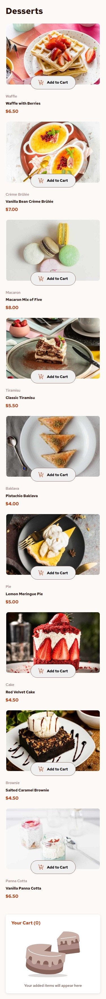
#### Selected
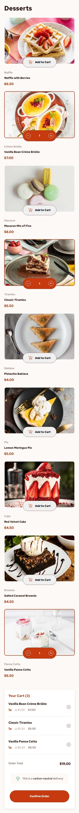
#### Order Confirmed
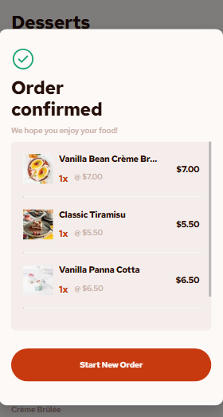

- ### Tablet designs:

#### Empty
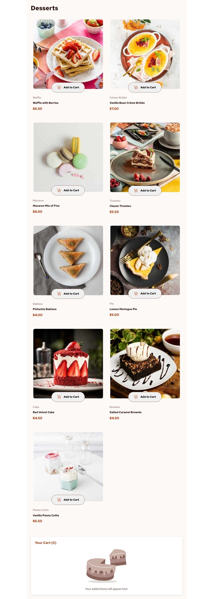
#### Selected
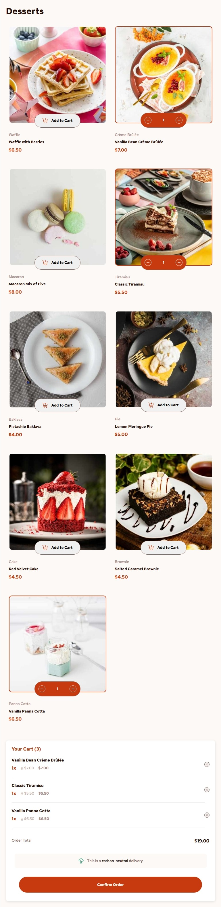
#### Order Confirmed
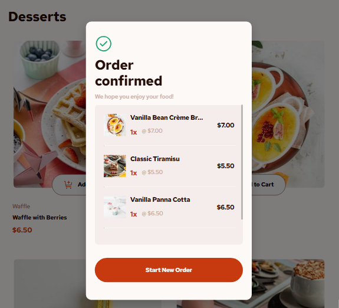

- ### Desktop designs bellow 1024px:

#### Empty
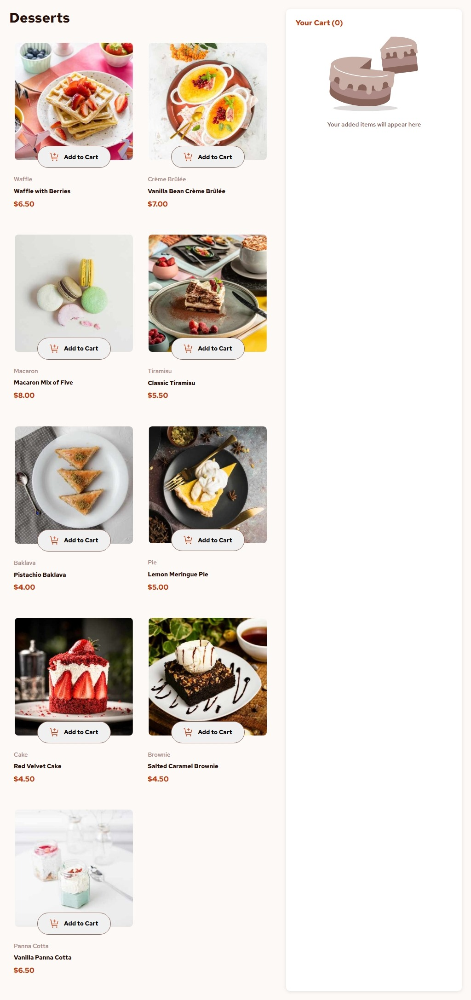
#### Selected
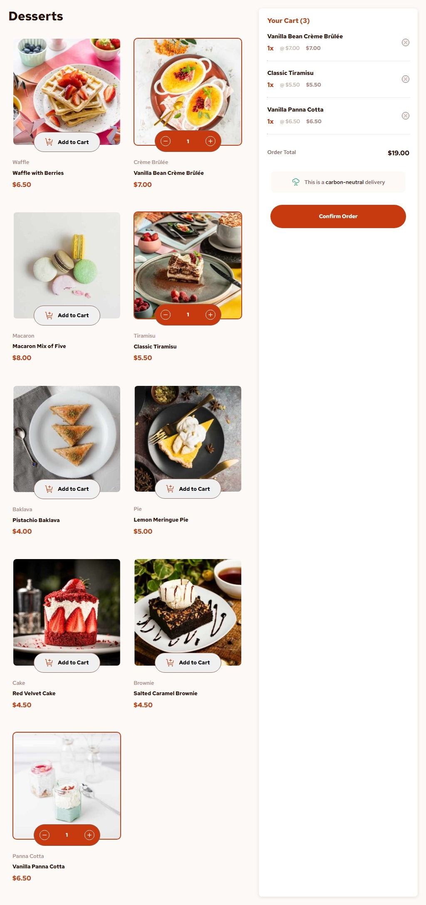
#### Order Confirmed
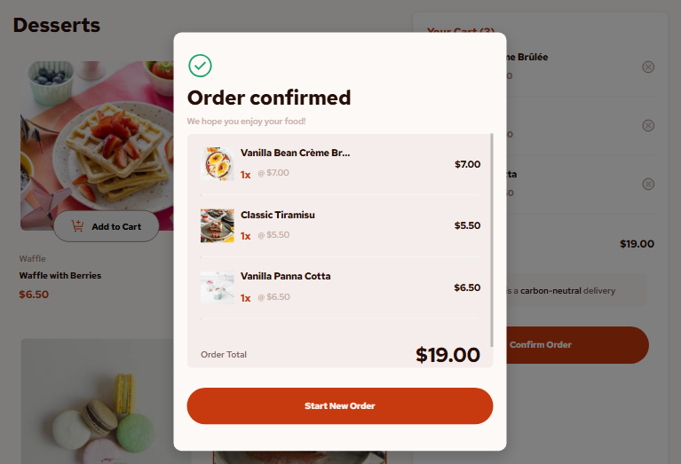

- ### Desktop designs above 1024px:

#### Empty
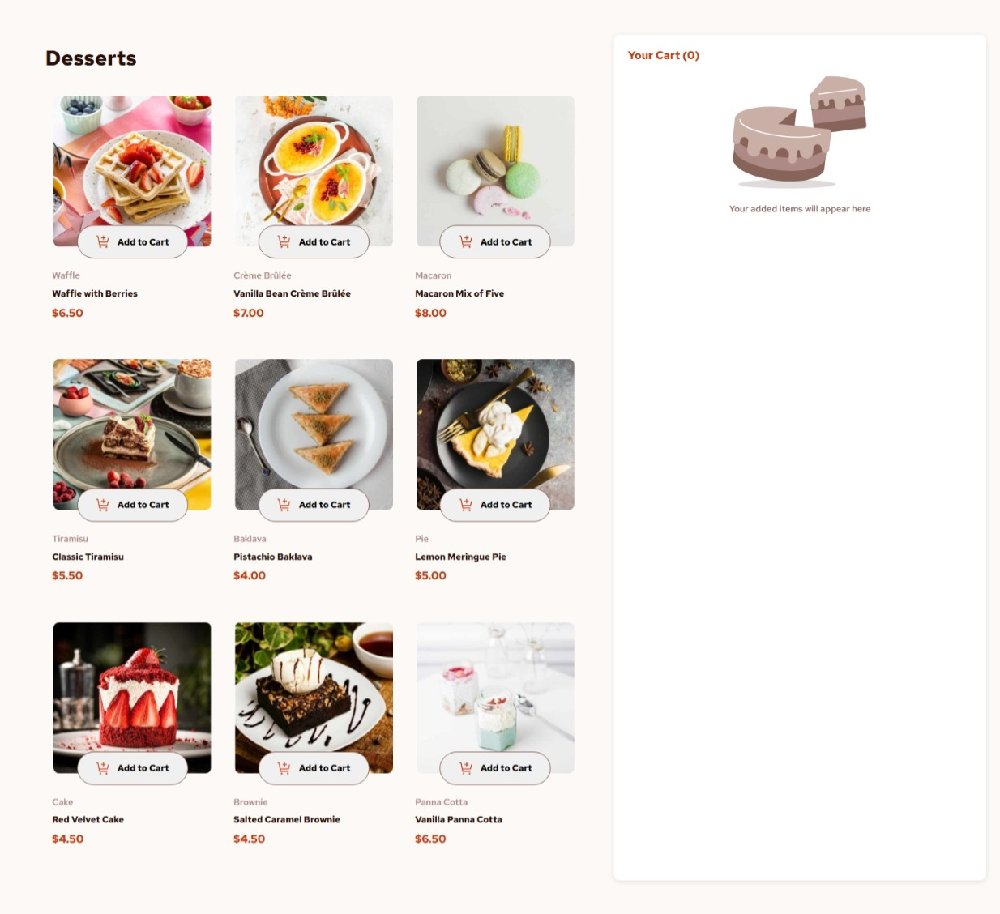
#### Selected
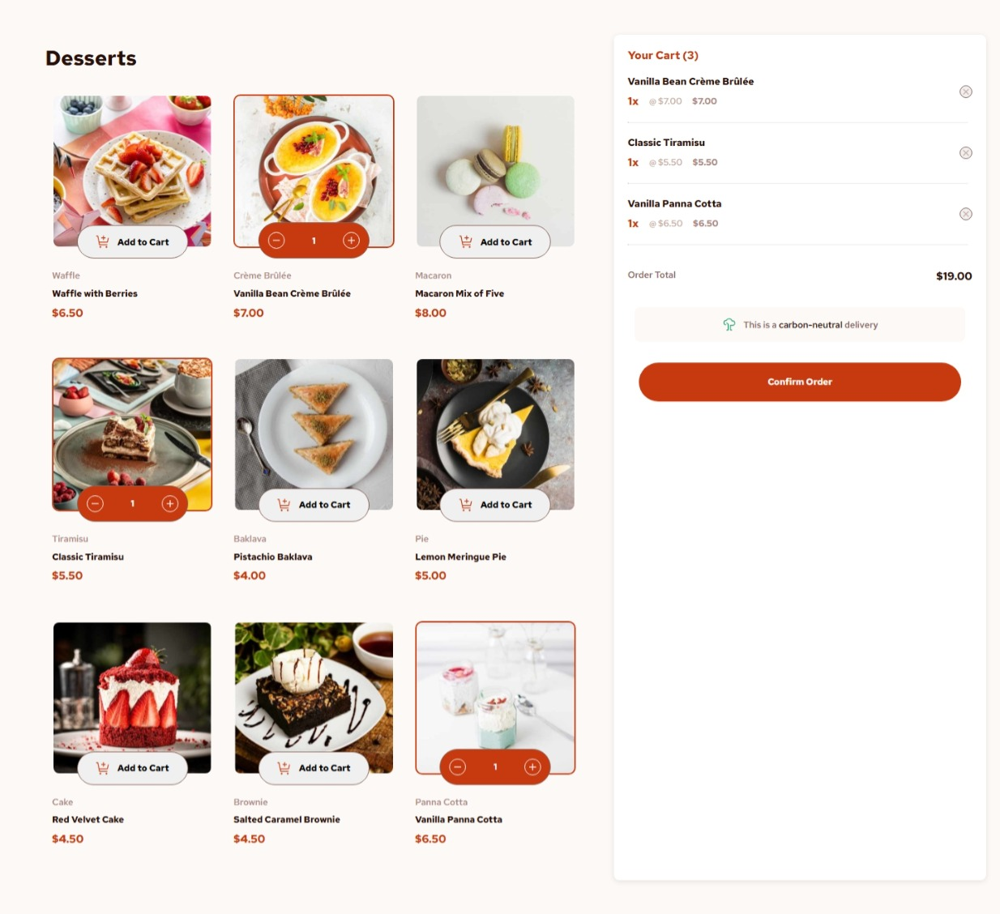
#### Order Confirmed


- Active state:

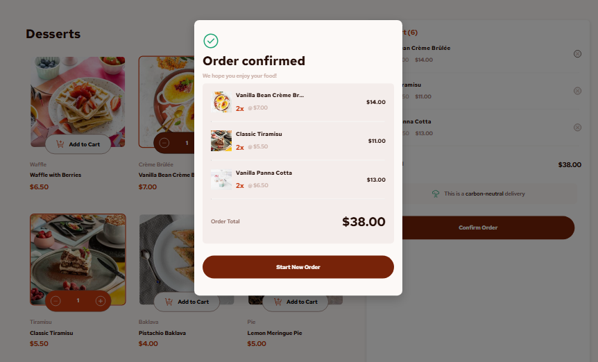

### Links

- Solution URL: [My Solution](https://github.com/gillaercio/product-list-with-cart-main)

## My process

### Built with

- Semantic HTML5 markup
- CSS custom properties
- Flexbox
- Mobile-first workflow
- JavaScript

### What I learned

I took advantage of this project to practice using **BEM** with **HTML**, **Reset CSS** with **CSS**, **Events** and **JSON** with **JavaScript**:

BEM

```html
<div class="cart__empty">
  
  <span class="cart__empty-message">Your added items will appear here</span>
</div>
```

RESET CSS

```css
*,
*::before,
*::after {
  margin: 0;
  padding: 0;
  box-sizing: border-box;
}
```

JSON

```js
document.addEventListener("DOMContentLoaded", () => {
  fetch("./data.json")
    .then(response => response.json())
    .then(data => {
      data.forEach((dessert, index) => {
        dessert.id = index + 1;
      });
      dessertsData = data;
      renderDesserts(dessertsData);

      window.addEventListener("resize", () => renderDesserts(dessertsData));

    })
    .catch(error => {
      console.error("Error loading data:", error);
    });
});
```

### Continued development

I would like to improve the use of the **HTML**, **CSS** and **JavaScript**.

## Author

- Frontend Mentor - [@gillaercio](https://www.frontendmentor.io/profile/gillaercio)
- Github - [My Github](https://github.com/gillaercio)
- LinkedIn - [My LinkedIn](https://www.linkedin.com/in/gildman-la%C3%A9rcio/)